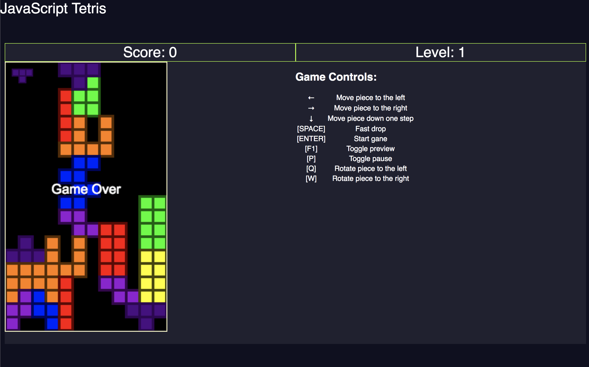

# JavaScript Tetris
A JavaScript Tetris game based on <em>[Write a Tetris game in JavaScript][mmm-tetris-github]</em>

The following functionalities were added:

- Improved rendering of the pieces with a dark stroke style based on the color of the piece
- Uses a generator function to yield new pieces
- Possible to adjust the probabilities for each piece
- Avoids rotating outside the arena bottom
- Fast drop by pressing the space-bar. No side movement is allowed in fast drop mode.
- Possible to pause and resume the game by pressing the "P" key
- Toggle of preview of the next piece by pressing the F1 key
- Levels with shorter drop period, starting with 1s period at level 1

[mmm-tetris-github]: https://github.com/meth-meth-method/tetris
